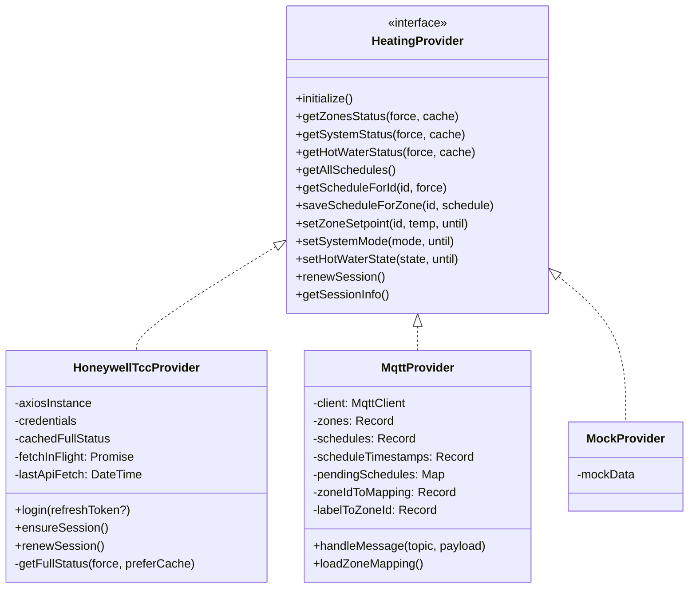

# evoWeb System Architecture

This document provides a detailed technical reference for the evoWeb system architecture, including data models, protocols, and implementation details.

## 1. Core Architectural Patterns

evoWeb follows a modular **Provider Pattern** to decouple the user interface from the underlying heating control protocol. Both providers initialise at startup and run **concurrently**; the active provider pointer controls which one serves the Scheduler UI, while dedicated REST endpoints expose live data from each provider independently.

### 1.1 Provider Interface



### 1.2 Dual-Provider Concurrency

Both `HoneywellTccProvider` and `MqttProvider` are initialised simultaneously at startup. The active provider pointer is switched via `POST /rest/selectprovider` and persisted to `.env`. Named endpoints (`/rest/cloud/...`, `/rest/mqtt/...`) always target the specific provider regardless of which is active.

```
┌────────────────────────────────────────────────────────────────────┐
│  Backend (Node.js / Express)                                       │
│                                                                    │
│  ┌──────────────────────┐    ┌──────────────────────────────────┐ │
│  │  HoneywellTccProvider│    │  MqttProvider                    │ │
│  │  (Cloud / Honeywell) │    │  (Local / evogateway)            │ │
│  └──────────┬───────────┘    └──────────────────┬───────────────┘ │
│             │                                   │                 │
│  ┌──────────▼───────────────────────────────────▼───────────────┐ │
│  │  Express REST API                                            │ │
│  │  /rest/cloud/*  /rest/mqtt/*  /rest/getcurrentstatus        │ │
│  └─────────────────────────────────────────────────────────────┘ │
└────────────────────────────────────────────────────────────────────┘
```

## 2. Backend Implementation Details

### 2.1 Honeywell TCC Provider (Cloud)

- **Authentication:** OAuth 2.0 with session persistence in `.session.json`. `renewSession()` uses `credentials.refreshToken` first; falls back to full password login if the token has expired.
- **Login rate-limiting:** Full re-authentication is blocked for `HONEYWELL_LOGIN_LIMIT` minutes (default 15) to respect Honeywell's rate limits.
- **Thundering herd protection:** `getFullStatus()` stores an in-flight `Promise` reference. Concurrent callers share a single HTTP request rather than spawning multiple simultaneous API calls.
- **Three-tier cache strategy:**
  1. **Short TTL** (`HONEYWELL_CACHE_TTL`, default 3 min): Normal cache within this window.
  2. **preferCache** path: Returns cached data even if the short TTL has elapsed (used for sequential DHW/system calls that follow a zones fetch).
  3. **Absolute ceiling** (`HONEYWELL_AUTO_REFRESH`, default 15 min): Forces a refresh regardless of caller preference once this threshold is exceeded.
- **API field mapping:** Zone setpoints read from `setpointStatus.targetHeatTemperature`; mode from `setpointStatus.setpointMode`.
- **Zone sync:** On initialisation, automatically writes zone names and IDs to `data/zones.json` for use by the MQTT provider.

### 2.2 MQTT Provider (Local)

- **Protocol:** Communicates with `evogateway` over MQTT using pub/sub topics.
- **Zone indexing:**
  - Standard zones: Internal decimal string (e.g., `"10"`) is converted to hex for MQTT commands (e.g., `"0A"`).
  - Hot Water: Uses `"HW"` as the fixed zone index.
- **Schedule timestamps:** Subscribes to `zone_schedule_ts` companion topics. Retained messages do **not** set a timestamp — only an explicit `get_schedule` request resolves the pending promise and records `fetchedAt`. This prevents retained-message delivery from appearing as "just synced".
- **Pending schedule resolution:** Pending promises are keyed by zone ID. When a schedule response arrives, resolution is attempted by both `zoneId` (derived from `zone_idx` field) and `zoneLabel` (MQTT topic segment) for resilience.
- **Schedule dual-caching:** Schedules are stored under both the derived zone ID and the topic label key to support resilient lookups across different identifier formats.
- **Zone mapping:** `zoneIdToMapping` (loaded from `data/zones.json`) maps decimal zone indices to `{name, label, honeywellId}`. `labelToZoneId` is the reverse lookup used when processing MQTT topic segments.

### 2.3 `data/zones.json` Format

```json
{
  "00": { "name": "Living Room", "label": "living_room", "honeywellId": "3596253" },
  "01": { "name": "Mstr Bedroom", "label": "mstr_bedroom", "honeywellId": "3626398" }
}
```

Keys are 2-digit decimal zone indices (as used by the MQTT provider internally). Labels are snake_case MQTT topic segments. `honeywellId` is the Honeywell cloud zone GUID.

## 3. Data Models

### 3.1 Zone Status

```typescript
interface ZoneStatus {
    zoneId: string;        // Decimal zone index (e.g. "10") for MQTT; Honeywell GUID for cloud
    name: string;          // User-friendly name
    label?: string;        // URL/topic-friendly name (e.g. "kitchen_ufh")
    temperature: number;   // Current temperature in °C
    setpoint: number;      // Current target temperature in °C
    setpointMode: string;  // e.g. "Following Schedule", "Permanent Override"
    until?: string;        // Expiration time for temporary overrides (ISO 8601)
}
```

### 3.2 Zone Schedule

```typescript
interface ZoneSchedule {
    name: string;
    schedule: DailySchedule[];
    fetchedAt?: string;    // ISO 8601 timestamp of last explicit refresh (MQTT only)
}

interface DailySchedule {
    dayOfWeek: string;     // e.g. "Monday"
    switchpoints: Switchpoint[];
}

interface Switchpoint {
    timeOfDay: string;         // HH:mm format (24h), snapped to SCHEDULER_TIME_RESOLUTION
    heatSetpoint?: number;     // Target temperature in °C (heating zones only)
    state?: string;            // "On" or "Off" (DHW only)
}
```

### 3.3 Provider Snapshots (Dashboard)

Each provider exposes a `ProviderSnapshot` for the dual-provider dashboard:

```typescript
interface ProviderSnapshot {
    zones: ZoneStatus[];
    dhw: DhwStatus | null;
    connected: boolean;
    status: string;
    error?: string;
}
```

## 4. Sequence Diagrams

### 4.1 Fetching a Schedule (MQTT)

```mermaid
sequenceDiagram
    participant UI as Frontend (Scheduler)
    participant API as Backend (REST)
    participant MQTT as MqttProvider
    participant Broker as MQTT Broker / evogateway

    UI->>API: GET /rest/getscheduleforzone/10
    API->>MQTT: getScheduleForId("10")
    Note over MQTT: Check this.schedules["10"] — cache miss
    MQTT->>Broker: Publish: get_schedule {zone_idx: "0A", force_refresh: false}
    Broker-->>MQTT: Topic: .../kitchen_ufh/ctl_controller/zone_schedule {schedule: [...]}
    MQTT->>MQTT: Resolve pending["10"]; record scheduleTimestamps["10"]
    MQTT-->>API: ZoneSchedule { name, schedule, fetchedAt }
    API-->>UI: JSON Schedule Response
```

### 4.2 Three-Tier Cache (Cloud Provider)

```
Request arrives → force=true?
  Yes → Fetch from API
  No  → secondsSinceLastApiFetch > autoRefreshMinutes * 60?
    Yes → Fetch from API (absolute ceiling)
    No  → preferCache=true?
      Yes → Return cached data
      No  → secondsSinceLastApiFetch > cacheTtlMinutes * 60?
        Yes → Fetch from API (short TTL expired)
        No  → Return cached data
```

## 5. Frontend Architecture

### 5.1 State Management

The frontend uses **Zustand** (with **Immer** for immutable updates) via `useHeatingStore`. Key state:

| Field | Type | Description |
|-------|------|-------------|
| `zones` | `ZoneStatus[]` | Active provider zone list |
| `schedules` | `Record<string, ZoneSchedule>` | Cached zone schedules |
| `selectedZoneId` | `string \| null` | Initialised from `localStorage`; persisted on change |
| `mqttSnapshot` | `ProviderSnapshot \| null` | MQTT provider live data (dashboard) |
| `cloudSnapshot` | `ProviderSnapshot \| null` | Cloud provider live data (dashboard) |
| `uiConfig` | object | Scheduler config from `/rest/config` |

### 5.2 Zone Persistence

`selectedZoneId` is initialised from `localStorage` (`evoWeb:lastZoneId`) when the store is created, so it is non-null before any component mounts. The App.tsx zones effect validates the stored ID against the loaded zones list and falls back to `zones[0]` if the stored ID is not found — handling provider switches where zone IDs differ between providers. `selectProvider()` clears the localStorage key before reloading so cross-provider stale IDs never carry over.

### 5.3 Scheduler Block Model

The `Scheduler.tsx` component converts between two representations:

1. **Switchpoints** (`Switchpoint[]`) — sparse list of time→value transitions stored by the backend.
2. **Blocks** (`number[]`) — a flat array of 144 values (at 10-minute resolution), one per block across 24 hours.

`switchpointsToBlocks` expands switchpoints by forward-filling values across the day. `blocksToSwitchpoints` compresses by emitting a switchpoint only when the value changes. Block indices are always integers; user-entered times are snapped with `Math.round(minutes / resolution)` before use.

### 5.4 Scheduler Slot Editing UX

Slots are edited via a floating action toolbar triggered by clicking any slot:

- **Single click** → shows floating toolbar: ✏ Edit · ＋ Add slot · 🗑 Delete
- **Double-click** → opens Edit Popover directly (shortcut)
- **Escape** or **click outside** → dismisses toolbar

The toolbar is rendered via `FloatingPortal` (from `@floating-ui/react`) anchored slightly over the selected slot, leaving the slot content visible underneath. The document-level `mousedown` listener dismisses the toolbar when a click lands outside the toolbar's DOM element.

**Add slot (＋):** Splits the selected slot at the click position. The right half is filled with `SCHEDULER_DEFAULT_TEMP`. If the slot is already at the default temperature, the right half is filled with `defaultTemp - 0.5` to ensure a visible split.

**Add slot from Edit Popover:** The Edit Popover exposes an "Add slot" button that creates a new sub-slot using the times and temperature currently entered in the form, writing those blocks directly without clearing existing blocks outside that range.

**Add first slot:** When a day row has no schedule data, it shows an "Add first slot" placeholder. Clicking it bootstraps a full-day switchpoint at `defaultTemp` (or Off for DHW), initialising the zone schedule structure if needed.

### 5.5 MQTT Schedule Staleness

Each zone's schedule carries a `fetchedAt` timestamp (populated from `zone_schedule_ts` MQTT topics or on explicit force-refresh). The Scheduler shows a staleness badge (`Xm/Xh/Xd ago`) coloured green/amber/red relative to `MQTT_SCHEDULE_STALE_DAYS`. A 1-minute interval ticker re-renders the badge. On zone selection, if the schedule is older than the threshold, an auto-refresh is triggered automatically.

### 5.6 Responsive Strategy

- **Mobile (< 640px):** Bottom-sheet popover replaces the desktop floating popover for slot editing.
- **Always-visible copy/paste:** Row-level copy/paste controls remain visible on mobile where hover states are unavailable.

## 6. REST API Summary

See `/rest/api` (served by the running backend) for the full live reference. Key groupings:

| Group | Endpoints |
|-------|-----------|
| Infrastructure | `/rest/session`, `/rest/config`, `/rest/renewsession`, `/rest/selectprovider`, `/rest/api` |
| Dual-provider status | `/rest/providers/status`, `/rest/mqtt/currentstatus[/item][?refresh=1]`, `/rest/cloud/currentstatus[/item][?refresh=1]` |
| Active provider — status | `/rest/getcurrentstatus[/item][?refresh=1]`, `/rest/getzones[/zone]`, `/rest/getdhw`, `/rest/getsystemmode` |
| Active provider — schedules | `/rest/getallschedules`, `/rest/getscheduleforzone/:zone[?refresh=true]`, `/rest/saveallschedules` |
| Active provider — control | `/rest/setzoneoverride`, `/rest/cancelzoneoverride`, `/rest/setsystemmode`, `/rest/setdhwstate`, `/rest/setdhwmodeauto` |
| MQTT utilities | `/rest/mqtt/refresh-mappings` |

All status endpoints accept an optional `/:item` path parameter (zone label, name, `dhw`, or `system`) and a `?refresh=1` query parameter to bypass the provider cache.

---
*This documentation reflects the modernised React/TypeScript codebase. The original jQuery version is preserved on the `legacy-jquery` branch.*
