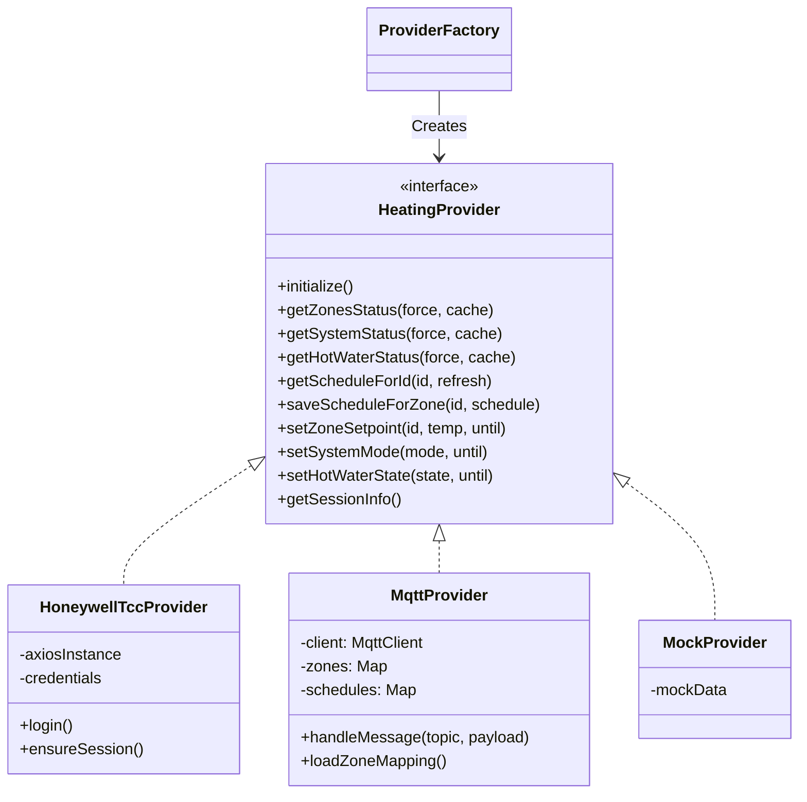
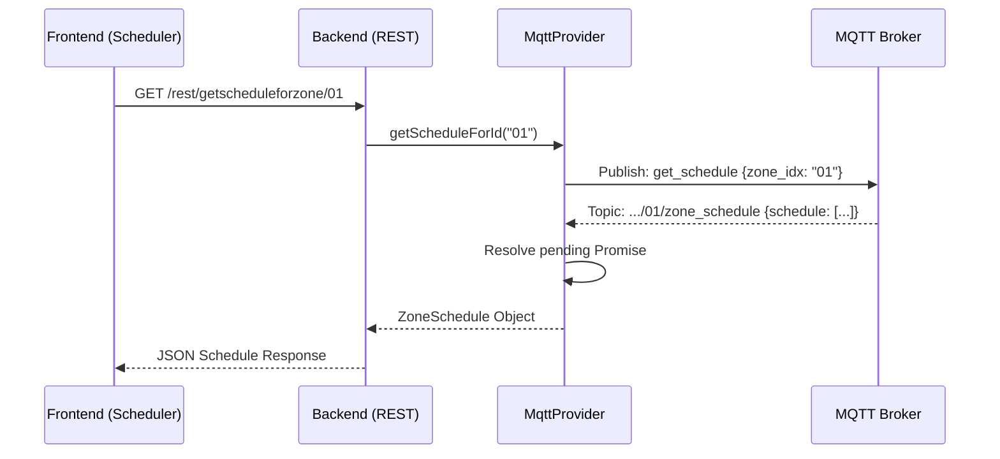

# evoWeb System Architecture

This document provides a detailed technical reference for the evoWeb system architecture, including data models, protocols, and implementation details.

## 1. Core Architectural Patterns

evoWeb follows a modular **Provider Pattern** to decouple the user interface from the underlying heating control protocol.

### 1.1 Provider Factory & Interface
The system interacts with heating hardware through a standard `HeatingProvider` interface.



## 2. Backend Implementation Details

### 2.1 Honeywell TCC Provider (Cloud)
- **Authentication:** Uses OAuth 2.0 with a session file (`.session.json`) to persist tokens.
- **Login Guard:** Implements a strict 15-minute lockout for full re-authentication attempts to avoid Honeywell's rate limiting.
- **Data Conversion:** Translates between Honeywell's complex JSON responses and the clean `evoWeb` data models.
- **Auto-Sync:** On successful login, it automatically syncs zone names and IDs to `config/zones.json` for use by the MQTT provider.

### 2.2 MQTT Provider (Local)
- **Protocol:** Communicates with `evogateway` over MQTT.
- **Zone Indexing:**
  - Standard Zones: Decimal string (e.g., "10") is converted to Hex for commands (e.g., "0A").
  - Hot Water: Uses `"HW"` as the fixed index for commands.
- **Switchpoints:** 
  - **Heating:** Uses `heat_setpoint` key (float).
  - **Hot Water:** Uses `enabled` key (boolean true/false).
- **Self-Learning Mapping:**
  - Upon receiving status messages, the provider dynamically maps zone labels (from MQTT topics) to system IDs.
  - Updates `config/zones.json` automatically when new mapping data is discovered.
- **Optimized Subscriptions:** Uses `+` wildcards and specific topic filters to minimize background noise while capturing all relevant status updates.

## 3. Data Models

### 3.1 Zone Status
```typescript
interface ZoneStatus {
    zoneId: string;        // Honeywell GUID or MQTT index (e.g. "01")
    name: string;          // User-friendly name
    label: string;         // URL/Topic-friendly name (e.g. "living_room")
    temperature: number;   // Current temperature in °C
    setpoint: number;      // Current target temperature in °C
    setpointMode: string;  // e.g. "Following Schedule", "Permanent Override"
    until?: string;        // Expiration time for temporary overrides
}
```

### 3.2 Switchpoint
```typescript
interface Switchpoint {
    timeOfDay: string;     // HH:mm format (24h)
    heatSetpoint?: number; // Target temperature (Heating only)
    state?: string;        // "On" or "Off" (DHW only)
    enabled?: boolean;     // Internal MQTT mapping for DHW
}
```

## 4. Sequence Diagrams

### 4.1 Fetching Schedule (MQTT)


## 5. Frontend Architecture

### 5.1 The Scheduler Logic
The `Scheduler.tsx` component handles the visualization and manipulation of heating slots.

- **Time Resolution:** Operates on a **10-minute resolution** (144 blocks per 24 hours).
- **Blocks to Switchpoints:**
  1.  Takes the provider's `Switchpoint[]` list.
  2.  Expands it into a flat array of 144 numeric values (temperatures or 0/1 for DHW).
  3.  Allows the user to "paint" or "resize" these blocks.
  4.  Compresses the 144 blocks back into a minimal `Switchpoint[]` list (detecting value changes) before saving.
- **Modes:**
  - **Resize Mode:** Dragging the edges of a slot updates the start/end blocks.
  - **Split Mode:** Double-clicking a slot splits it into two identical slots at the midpoint.
- **Focus Mode:** The scheduler highlights the active zone's real-time status (temp vs target) to provide immediate feedback during edits.

### 5.2 Responsive Strategy
- **Mobile View:** On small screens, the scheduler uses a vertical stack with simplified controls.
- **Always Visible Copy/Paste:** Specifically implemented for touch devices where hover states aren't available.

## 6. API Documentation

| Method | Endpoint | Description |
| :--- | :--- | :--- |
| GET | `/rest/getcurrentstatus` | Returns zones, dhw, and system status in one call. |
| GET | `/rest/getscheduleforzone/:id` | Returns the weekly schedule for a specific zone or DHW. |
| POST | `/rest/saveallschedules` | Saves the entire pending schedule batch to the hardware. |
| POST | `/rest/setzoneoverride` | Sets a temporary or permanent setpoint for a zone. |
| POST | `/rest/selectprovider` | Switches the active backend provider (Cloud vs Local). |
| POST | `/rest/mqtt/refresh-mappings` | Force-syncs names from Cloud to Local mapping. |

---
*Note: This documentation is maintained for both human developers and as a reference context for AI agents working on the codebase.*
