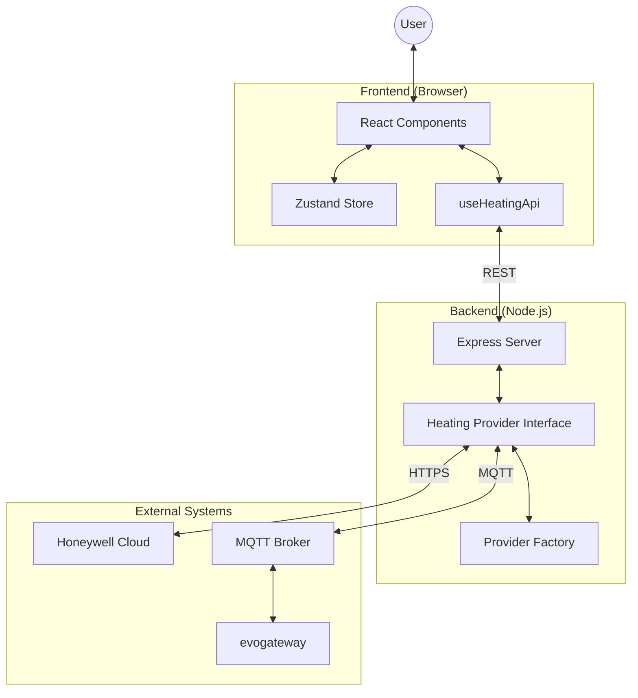

# evoWeb Development Guide

This guide is for developers working on the evoWeb codebase.

## Tech Stack

- **Frontend:** React 18, TypeScript, Vite, Tailwind CSS, Lucide-react (icons).
- **Backend:** Node.js, Express, TypeScript.
- **Protocol:** REST API between frontend and backend.
- **Providers:** Honeywell TCC (Cloud), MQTT (Local via evogateway), Mock (Demo).

## High-Level Architecture



## Getting Started

### Prerequisites
- Node.js 20+
- npm

### Installation
1. Clone the repository.
2. Install root dependencies: `npm install`
3. Install frontend dependencies: `cd frontend && npm install`
4. Create a `.env` file in the root (see `.env.example`).

### Running in Development
- **Backend:** `npm run dev` (starts on port 3330 by default).
- **Frontend:** `cd frontend && npm run dev` (starts Vite on port 5173).

## Testing

The project uses Jest for testing backend providers.

```bash
# Run all tests
npm test

# Run a specific test
npm test tests/MqttProvider.test.ts
```

## Building for Production

```bash
# Build backend
npm run build

# Build frontend
cd frontend && npm run build
```

The backend is configured to serve the built frontend from the `static/` directory in production.

## Code Style & Standards

- **TypeScript:** Use strict typing where possible.
- **Provider Pattern:** All new heating system integrations must implement the `HeatingProvider` interface.
- **State Management:** The frontend uses a custom store (Zustand-like pattern) in `useHeatingStore.ts`.
- **CSS:** Use Tailwind utility classes. For complex components, keep styles clean and modular.

## Documentation Reference
For deep technical details on how the system works, data models, and protocol specifics, see [ARCHITECTURE.md](./ARCHITECTURE.md).
