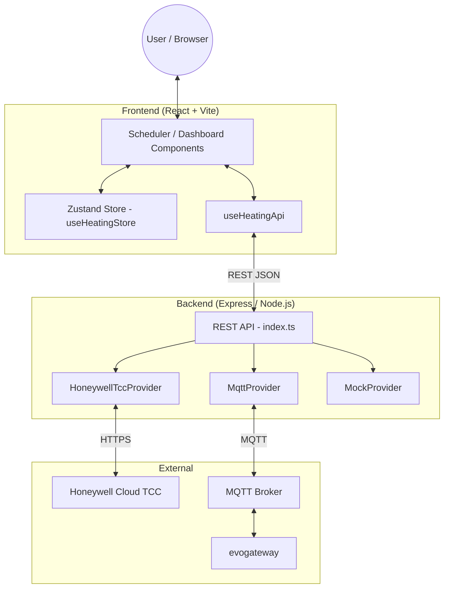

# evoWeb Development Guide

This guide covers setup, development workflow, and coding conventions for the evoWeb codebase.

## Tech Stack

| Layer | Technology |
|-------|-----------|
| Frontend | React 18, TypeScript, Vite, Tailwind CSS v4, Zustand + Immer, @floating-ui/react, Lucide React |
| Backend | Node.js 22, Express, TypeScript, ts-node / nodemon |
| State management | Zustand (with Immer for immutable updates) |
| Providers | Honeywell TCC (Cloud), MQTT (Local via evogateway), Mock (Demo) |
| Containerisation | Docker (multi-stage build), Docker Compose |

## High-Level Architecture



Both `HoneywellTccProvider` and `MqttProvider` initialise at startup and run concurrently. The *active provider* pointer controls which provider serves the Scheduler UI. Dedicated `/rest/cloud/*` and `/rest/mqtt/*` endpoints always address the specific provider regardless of the active selection.

## Repository Layout

```
/opt/evoWeb.dev/
├── src/                    # Backend TypeScript source
│   ├── index.ts            # Express server + all REST routes
│   ├── config/index.ts     # Centralised config (reads .env)
│   ├── providers/
│   │   ├── HeatingProvider.ts      # Interface + shared types
│   │   ├── HoneywellTccProvider.ts # Cloud provider
│   │   ├── MqttProvider.ts         # Local MQTT provider
│   │   └── MockProvider.ts         # Demo/test provider
│   └── utils/Logger.ts
├── frontend/               # React + Vite frontend
│   ├── src/
│   │   ├── App.tsx                 # Root component, dual-provider dashboard
│   │   ├── components/
│   │   │   ├── Scheduler.tsx       # Main schedule editor
│   │   │   └── ZoneSelector.tsx    # Zone dropdown
│   │   ├── api/useHeatingApi.ts    # REST client hooks
│   │   └── store/useHeatingStore.ts # Zustand store
│   ├── tailwind.config.js
│   └── vite.config.ts
├── data/
│   └── zones.json          # Zone name/label/ID mapping (MQTT ↔ Cloud)
├── Dockerfile              # Multi-stage: frontend-build → backend-build → production
├── docker-compose.yml
├── .env                    # Local config (not committed)
└── .env.example            # Config template with inline comments
```

## Getting Started

### Prerequisites

- Node.js 22+
- npm
- Docker (for production builds and validation)

### Installation

```bash
git clone https://github.com/smar000/evohome-Scheduler-GUI.git
cd evohome-Scheduler-GUI
npm install
cd frontend && npm install && cd ..
cp .env.example .env
# Edit .env with credentials
```

### Running in Development

```bash
# Start backend (live-reloads on change via nodemon)
npm run dev

# The backend serves the compiled frontend from frontend/dist/
# After any frontend source change, rebuild it:
cd frontend && npm run build
```

> **Important:** `npm run dev` starts only the backend. The frontend is served as static files from `frontend/dist/`. There is no separate Vite dev server in this project's normal workflow — always rebuild the frontend after changes.

### Environment Variables

All configuration lives in `.env`. Key variables:

| Variable | Default | Description |
|----------|---------|-------------|
| `PORT` | `3330` | Backend listen port |
| `HEATING_PROVIDER` | `honeywell` | Active provider (`honeywell`, `mqtt`, `mock`) |
| `HONEYWELL_USERNAME` | — | Honeywell TCC email |
| `HONEYWELL_PASSWORD` | — | Honeywell TCC password |
| `HONEYWELL_AUTO_REFRESH` | `15` | Minutes before cloud data is force-refreshed |
| `MQTT_BROKER_URL` | — | MQTT broker URL (e.g. `mqtt://192.168.1.x:1883`) |
| `MQTT_BASE_TOPIC` | `evohome/evogateway` | Root MQTT topic |
| `MQTT_SCHEDULE_STALE_DAYS` | `7` | Days before a cached MQTT schedule triggers auto-refresh |
| `SCHEDULER_TIME_RESOLUTION` | `10` | Minutes per schedule block (must divide 60 evenly) |
| `SCHEDULER_DEFAULT_TEMP` | `20` | Default temperature for new slots (°C) |

See `.env.example` for the full list with explanatory comments.

## Building for Production

### Frontend

```bash
cd frontend && npm run build
```

This runs `tsc -p tsconfig.app.json` (strict) then `vite build`. Output goes to `frontend/dist/` which is served as `../static/` by the backend.

### Docker (recommended)

```bash
# Build and tag
docker build -t evoweb:latest .

# Or via Compose
docker compose build
docker compose up -d
```

The Dockerfile uses a three-stage multi-stage build:

1. **frontend-build** — installs frontend deps, runs strict `tsc`, then Vite build.
2. **backend-build** — installs all deps, compiles TypeScript backend.
3. **Production** — minimal image: production deps only, compiled backend, static frontend.

> **Pre-commit validation:** Always run a Docker build before committing to catch TypeScript errors that the local `npm run build` may miss. The Dockerfile applies stricter `tsc` flags than the local dev build.

## Code Style & Conventions

### TypeScript

- Strict typing enforced by `tsconfig.app.json` in the frontend Docker build.
- Use `as any` only as a last resort for Express `req.params` with optional segments.

### Provider Pattern

All new heating integrations must implement the `HeatingProvider` interface in `src/providers/HeatingProvider.ts`. Providers must be stateless with respect to the REST layer — the provider holds its own cache internally.

### Frontend State

- All shared state lives in the Zustand store (`useHeatingStore.ts`).
- Mutations go through store actions; never mutate store state directly.
- Use Immer (`produce`) for nested state updates (e.g. `schedules`).
- `selectedZoneId` is initialised from `localStorage` in the store constructor — this ensures it is non-null before any component effect runs.

### REST Endpoints

- Zone lookups use `findZone()` (matches by label, normalised name, or zoneId).
- Force-refresh is controlled by `isRefresh(req.query.refresh)` (accepts `"1"` or `"true"`).
- All status endpoints support optional `/:item` path parameters.

### Frontend Rebuild Reminder

After every change to a file under `frontend/src/`, run:

```bash
cd /opt/evoWeb.dev/frontend && npm run build
```

The backend serves static files from `frontend/dist/`. Changes are not visible until the frontend is rebuilt.

## Git Workflow

- Working branch: `feat/modernized-frontend-scheduler`
- Remote: `github` (token auth configured on the server)
- `master` — current modernised codebase
- `legacy-jquery` — original jQuery version (preserved for reference)

Push to master:
```bash
git push github feat/modernized-frontend-scheduler:master
```

## API Reference

Visit `/rest/api` on the running server for the full interactive endpoint reference.

For architecture details, data models, and sequence diagrams see [ARCHITECTURE.md](./ARCHITECTURE.md).
