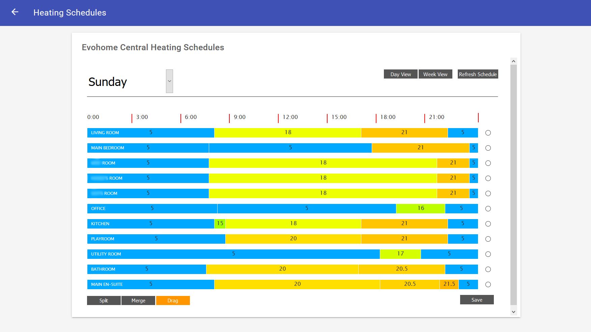

# Browser-based Graphical Schedule Editor for evohome

At present (May 2018), the Honeywell evohome smart thermostat system only supports editing of heating/hotwater schedules using a mobile phone app. Honeywell's browser based Total Connect Comfort web portal seems to have ignored scheduling entirely. 

As I prefer editing schedules on a larger screen - especially when making changes across upto 12 zones - and preferably integrated into my home automation system [openHAB](https://www.openhab.org), I put together a simple node.js based system which provides a front-end for viewing/editing zone schedules a week at a time, or across all zones for a given day. 

Whilst I was at it, I also added support for getting current zone temperatures/setpoints, changing setpoints, controlling hot water and changing between the evohome controller modes, just to have everything through a single system.

## Installation
Prerequisite: **node.js version 8.x is required**. Testing has only been done on node.js version 8.11.1

With node installed correctly, go into the folder into which you have downloaded the source, install the required dependencies:

    npm install

Copy the `config/config.json.example` file to `config/config.json`, and edit it as required.

and then start the server:
    
    node server.js

There is a `systemd` unit file in the `misc/systemd` folder, that can be used as a template for running the application as a service.

If you are using [openHAB](https://www.openhab.org), there is a wrapper html file in the `misc/openhab` folder which puts the evohome scheduler page in an iframe. Place this file in your openhab's `conf/html` folder, and put it onto your sitemap in the usual way as a webview.

**Note:** This solution is completely unofficial and is not supported by Honeywell in any way. It was put together for my personal use and as such may not work properly, may not do what you need etc etc. Use entirely at your own risk :)

## Editing Schedules

Schedules are shown as a series of 'slots' for a given day or zone. The start/end of the slots can be modified by dragging, or by entering the exact times into the edit console that pops up above the schedule.

* Setpoints can be edited directly in the slot, by clicking on the setpoint value, or using the edit console pop-up as before.

* When in *Drag* mode, start/end times for a given setpoint can be adjusted by dragging the grips between slots or by directly editing the time in the edit console pop-up. 

* Slots can be merged by first clicking the *Merge* button, and then clicking on the seperator between two slots. 

* Slots can be split to provide additional setpoint times by clicking the 'Split' button first, and then clicking inside any slot. Evohome supports a maximum of 6 setpoints a day.

## Other Functionality
The server also supports:

* Get a list of the current zones, and their properties:  `/rest/getzones`

* Get the hot water 'zone', if it exists (named 'dhw' for domestic hot water): `/rest/getdhw`

* Changing a zone's current setpoint, permanently or until a given date/time by POSTing to: `/rest/setzoneoverride`

  The body of the POST command should include the zone name (as configured in the evohome controller), setpoint and until as JSON object, e.g. `{"zoneName":"Living Room", "setpoint": 20.0, "until": "20180518T17:35:00Z"}`. 
  
  Leave out the `"until"` parameter to set the setpoint permanently.

  Also remember to set header for `application/json` when making the POST. This applies to all POSt commands.

* Turn on/off the hot water: `/setdhwstate`

  Format of the JSON body is similarly `{"state": "On", "until": "until": "20180518T21:00:00Z"}`

* Set the hot water mode back to schedule: `/rest/setdhwmodeauto`

  No body is required for this command.
   
* Changing the system's mode between Auto, EcoWithAuto, Custom, DayOff, HeatingOff: `/rest/setsystemmode`

  Again, these can be set until a specific time via the "until" parameter, or permanently if this is omitted, e.g: `{"mode": "AutoWithEco"}`
 
A list of the available endpoints can be found by going to the `/rest/endpoints` page.

## To Do...
As this is the first time I have used node js, there is probably a lot of things that could be done better. Also there are a few areas left incomplete. Most are things that I am not using at the moment or particularly concerned about tidying up at this stage, but I am always open to pull requests.

Hot water schedules are available through the rest endpoint, but not currently being displayed in the grid display as it needs to be handled slightly differently (it requires zone setpoint to be replaced by On/Off etc). This is because I am not currently using schedules as I have openHAB automatically turning on the water whenever the water temperature drops below a predefined level. However, it probably wouldn't be too difficult to add.

I haven't come across any signficant bugs, but please do note that I have not tested extensively. However, it has been in use in my home for the last few weeks.

## Credits
* The css/logic for the schedule's grid display is based on an old [Emon CMS project](https://github.com/emoncms/development/blob/master/experimental/control/open_thermostat_scheduler/web/heating.html). 

* Interfacing to the evohome servers is based primarily on [WatchForStock's python scripts](https://github.com/watchforstock/evohome-client/tree/master/evohomeclient2), and also some reference to luc-ass's [evohome/Homebridge code](https://github.com/luc-ass/homebridge-evohome).
 
* Finally, auto-resizing of iFrames (when used in an embedded page, such as with openHAB) is done using [iFrameResizer](https://github.com/davidjbradshaw/iframe-resizer/blob/master/js/iframeResizer.contentWindow.min.js). 
