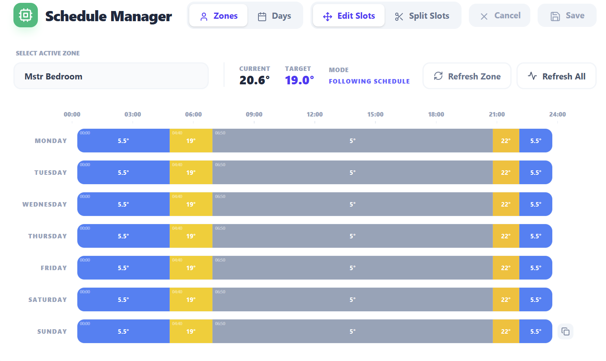

# evoWeb: Browser-based Schedule Editor for Honeywell evohome

**evoWeb** is a web-based interface for managing Honeywell evohome heating system schedules. While Honeywell provides official mobile applications, this project was developed to address the lack of a dedicated, browser-accessible portal suitable for desktop use and integration into home automation dashboards.

This application was created to meet a specific personal requirement for a more flexible scheduling interface and is shared in the hope that it may be of use to others with similar needs.



## Overview

*   **Browser-Based:** Provides schedule management from any desktop or tablet browser without the need for a mobile app.
*   **Automation Integration:** Designed for embedding within iframes, facilitating integration into platforms such as [openHAB](https://www.openhab.org) (e.g., HABPanel or Basic UI).
*   **Dual-Mode Support:** Supports communication via official Honeywell Cloud APIs (TCC) or local control via MQTT when used with [evogateway](https://github.com/zxdavb/evogateway).
*   **Visual Grid Editor:** Offers a graphical representation of weekly schedules for intuitive editing.

## Project Status

This tool is considered feature-complete for its original intended purpose. No significant further development is planned beyond minor bug fixes. However, the project remains open to community contributions; bug reports and pull requests are welcome.

## Understanding "Slots"

In the evohome system, a daily schedule consists of **Slots**. 
*   A **Slot** represents a specific time period (e.g., 07:00 to 09:00) with a defined target temperature (e.g., 21°C).
*   The entire 24-hour period is covered by contiguous slots.
*   The end of one slot marks the immediate start of the next.

## Schedule Management

The **Scheduler** tab facilitates the viewing and editing of heating plans through two primary modes:

*   **Zone View (Week View):** Displays the 7-day schedule for a single selected zone.
*   **Day View (Multi-Zone View):** Displays the schedules of all zones for a single selected day, allowing for easier comparison and synchronization across the home.

### Editing a Slot
1.  **Double-clicking** a slot in the grid opens the **Edit Popover**.
2.  The **Start Time**, **End Time**, or **Target Temperature** may be adjusted.
3.  Clicking **Apply** updates the local session view.

### Resizing and Moving Slots
Toggling the **Edit** mode enables boundary adjustments:
*   Handles appear at the boundaries of each slot.
*   Dragging these handles allows for precise adjustment of slot start and end times.

### Splitting and Deleting
*   **Split:** Toggling **Split** mode and double-clicking inside a slot divides it into two segments.
*   **Delete:** Clicking **Delete** within the Edit Popover removes the slot and merges the resulting gap into the preceding slot.

### Saving Changes
Modifications remain local to the browser session until the **Save** button is clicked. This action pushes the updated weekly schedule to the evohome controller.

## Status Indicators

The system provides real-time connection feedback via status badges.

### evoGateway (Local Mode)
*   **evoGateway: Online (Green):** Successful communication with the local hardware gateway.
*   **evoGateway: Offline (Red):** The gateway is unresponsive or the MQTT broker connection has been lost.

### TCC (Cloud Mode)
*   **TCC: Authenticated (Green):** Successful session established with Honeywell Total Connect Comfort services.
*   **TCC: Not Authenticated (Red):** Authentication failed or the session has expired.

## Configuration (.env)

System behavior is managed via environment variables.

### Basic Settings
*   `HEATING_PROVIDER`: Specifies `honeywell` or `mqtt`.
*   `MQTT_BASE_TOPIC`: Defines the root MQTT topic (default: `evohome/evogateway`).

### Advanced Configuration
| Parameter | Default | Description |
| :--- | :--- | :--- |
| `HONEYWELL_CACHE_TTL` | `3` | Minutes to cache cloud data before a refresh is required. |
| `HONEYWELL_LOGIN_LIMIT` | `15` | Minutes to wait between full re-authentications. |
| `MQTT_RECONNECT_PERIOD` | `5000` | Milliseconds between MQTT reconnection attempts. |
| `MQTT_SCHEDULE_TIMEOUT` | `10000` | Milliseconds to wait for an MQTT schedule response. |
| `SCHEDULER_TIME_RESOLUTION` | `10` | The granularity of the grid (in minutes). |
| `SCHEDULER_DEFAULT_TEMP` | `20` | Default temperature for newly created slots. |

## Installation

### Using Docker (Recommended)
```bash
# 1. Clone and configure
git clone https://github.com/smar000/evohome-Scheduler-GUI.git evoweb
cd evoweb
cp .env.example .env

# 2. Run
docker-compose up --build -d
```

### Manual Installation
Prerequisites: **Node.js 20+**
```bash
npm install
cd frontend && npm install && cd ..
npm run build
npm run start:evoweb
```

## openHAB Integration

Navigation may be hidden to focus on a single zone for embedding:
```
http://<your-ip>:3330/?embed=true&zoneId=01
```

---
*Disclaimer: This project is unofficial and not affiliated with Honeywell. Use at your own risk.*
