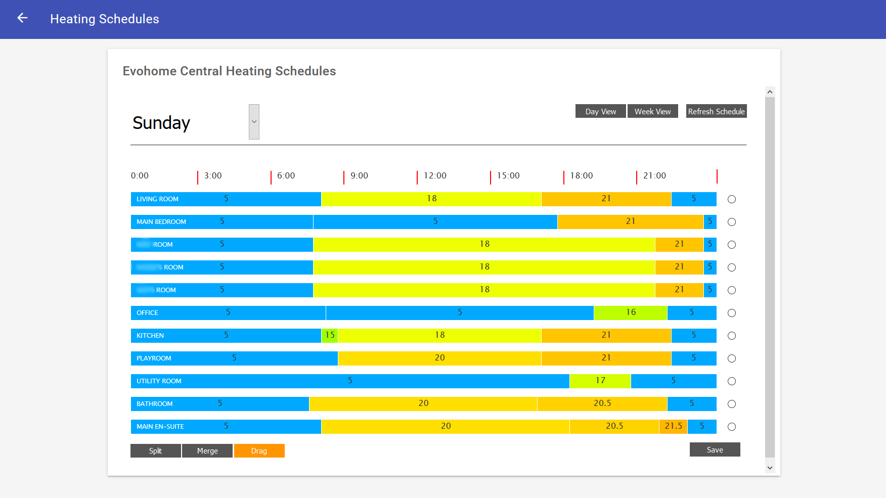

# evoWeb: Smart Heating Scheduler

**evoWeb** is a modernized heating management dashboard for Honeywell Evohome systems. It provides a high-quality, responsive React interface to manage heating schedules and monitor real-time temperatures using both Cloud (Honeywell TCC) and Local (MQTT/evogateway) control methods.



## Core Features

-   **Dual Control Modes:** Seamlessly switch between Honeywell TCC Cloud API and local MQTT control via `evogateway`.
-   **Modern Scheduler:** Drag-and-drop-style schedule management with multi-zone and multi-day views.
-   **Live Dashboard:** Real-time monitoring of zone temperatures, setpoints, and hot water status.
-   **Provider Pattern:** Modular backend architecture allows for easy extension to new heating hardware.
-   **Focus Mode:** Integrated real-time status display within the scheduler for the active zone.
-   **Responsive Design:** Optimized for mobile touch devices with always-visible copy/paste support.
-   **Embed Support:** Integrated iframe support via `?embed=true&zoneId=XX`.

## Tech Stack

-   **Frontend:** React (TypeScript), Zustand (State Management), TailwindCSS, Lucide Icons.
-   **Backend:** Node.js (TypeScript), Express, Axios, MQTT.js, Luxon.
-   **Infrastructure:** Docker (Multi-stage build), Docker Compose.

## Quick Start

### 1. Prerequisites
-   Docker and Docker Compose installed.
-   (Optional) A Honeywell TCC account or a local `evogateway` MQTT broker.

### 2. Configuration
Copy the example environment file and fill in your credentials:
```bash
cp .env.example .env
```
Edit `.env` with your Honeywell username/password and MQTT broker details.

### 3. Run with Docker
```bash
docker-compose up --build
```
Access the application at `http://localhost:3330`.

## Architecture & Development

### Provider System
The application uses a `HeatingProvider` interface. The active provider can be switched in real-time via the UI or by changing `HEATING_PROVIDER` in your `.env`.

-   **HoneywellTccProvider:** Connects to the TCC Cloud API. Includes automatic token refresh and retry logic.
-   **MqttProvider:** Communicates with a local `evogateway`. Uses a 2-digit hexadecimal mapping for zone IDs (e.g., Decimal `10` -> Hex `0A`).

### Zone Mapping
Zone names and labels are cached in `config/zones.json`. If you are using MQTT mode, you can sync these mappings from the Cloud by clicking the **"Sync Zones"** button in the UI.

### Project Structure
-   `/src`: Backend source code (TypeScript).
-   `/frontend`: React application source.
-   `/dist`: Compiled backend code.
-   `/static`: Compiled frontend build.
-   `/config`: Persistent configuration and zone mappings.

## Deployment Notes
The Docker container maps the `.env` file as a volume. This allows the application to persist your provider selection and session information across restarts.

---
*Created by SMAR. Modernized in 2026.*
